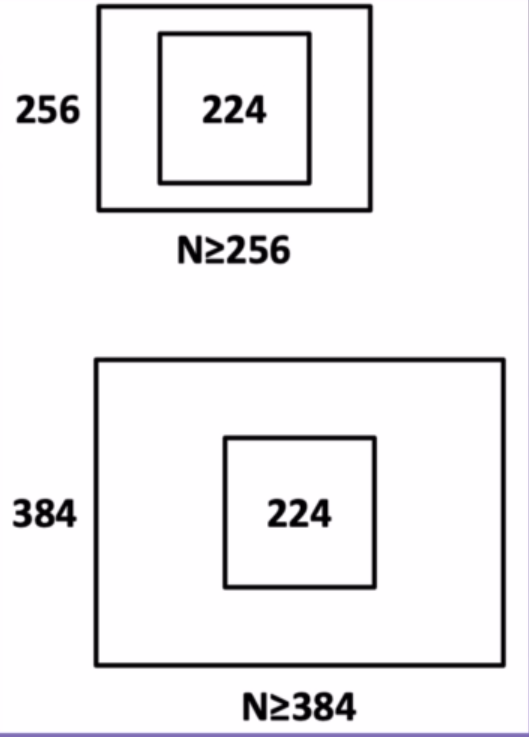
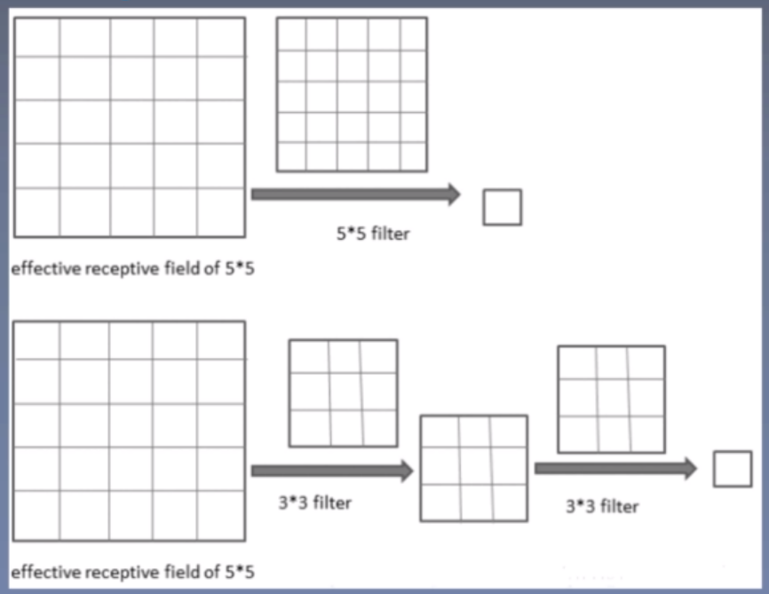

# CV_Baseline

基础网络架构论文的导读重点笔记如下。

 * [1.ImageNet Classification with Deep Convolutional Neural Network (AlexNet)](#1imagenet-classification-with-deep-convolutional-neural-network--alexnet-)
  * [2.Very Deep Convolutional Networks for Large-scale Image Recognition (VGG)](#2very-deep-convolutional-networks-for-large-scale-image-recognition--vgg-)
  * [3.Going Deeper with Convolutions (GoogleNetv1)](#3going-deeper-with-convolutions--googlenetv1-)
  * [4.Batch Normalization: Accelerating Deep Network Training by Reducing Internal Covariate Shift (GoogleNet v2)](#4batch-normalization--accelerating-deep-network-training-by-reducing-internal-covariate-shift--googlenet-v2-)
  * [5.Rethinking the Inception Architecture for Computer Vision (GoogleNet-v3)](#5rethinking-the-inception-architecture-for-computer-vision--googlenet-v3-)
  * [6.Deep Residual Learning for Image Recognition (ResNet)](#6deep-residual-learning-for-image-recognition--resnet-)
  * [7.Inception-v4, Inception-ResNet and the Impact of Residual Connections on Learning (GoogleNet-v4)](#7inception-v4--inception-resnet-and-the-impact-of-residual-connections-on-learning--googlenet-v4-)
  * [8. Aggregated Residual Transformations for Deep Neural Networks (ResNeXt)](#8-aggregated-residual-transformations-for-deep-neural-networks--resnext-)
  * [9. Densely Connected Convolutional Networks](#9-densely-connected-convolutional-networks)
  * [10. Sequeeze and Excitation Networks](#10-sequeeze-and-excitation-networks)

## 1.ImageNet Classification with Deep Convolutional Neural Network (AlexNet)

1. 研究背景

Dataset: Mnist, Cifar-10, ILSVRC-2012 

|             | 类别 | 训练数据 | 测试数据 | 图片格式 |
| ----------- | ---- | -------- | -------- | -------- |
| Mnist       | 10   | 50000    | 10000    | Gray     |
| Cifar-10    | 10   | 50000    | 10000    | RGB      |
| ILSVRC-2012 | 1000 | 1200000  | 150000   | RGB      |

ILSVRC：大规模图像识别挑战赛

比赛项目：图像分类，目标定位，目标检测，视频目标检测，场景分类，场景解析

经典模型：Alexnet, vgg, googlenet, resnet, densenet 

ImageNet:包含21841个类别，14197122张图片，其中ILSVRC-2012从Imagenet中挑选的1000类的1200000张图片作为训练集

Top5 error: For each image, an algorithm will produce 5 labels $l_{j}, j=1,...,5$. The ground truth labels for the image are $g_{k}, k=1,...,n$ with $n$ classes of objects labeled. The error of algorithm for that image would be $e=\frac{1}{n}\sum_{k}min_{j}d(l_{j},g_{k})$. $d(x,y)=0$ if $x=y$ and 1 otherwise. The overall error score for an algorithm is the average error over all test images. Note that for this version of the competition, $n=1$, that is , one ground truth label per image. 

强大的计算资源-GPU：高性能计算资源使得大型神经网络可以快速训练。

2. 研究成果及意义

AlexNet在ILSVRC-2012以超过第二名10.9个百分点夺冠

SIFT+FVS：ILSVRC-2012分类任务的第二名

1CNN：训练一个alexnet

5CNNs:训练五个Alexnet取平均值

1CNN*:在最后一个池化层后，额外添加第六个卷基层，并使用ImageNet 2011数据上预训练

7CNN*:两个预训练微调，与5CNNs取平均值

| model    | Top-1 | Top-5(val) | Top-5(test) |
| -------- | ----- | ---------- | ----------- |
| SIFT+FVs | -     | -          | 26.2%       |
| 1 CNN    | 40.7% | 18.2%      | -           |
| 5 CNNs   | 38.1% | 16.4%      | 16.4%       |
| 1 CNN*   | 39.0% | 16.4%      | -           |
| 7 CNNs*  | 36.7% | 15.4%      | 15.3%       |

意义：

（1）拉开卷积神经网络统治计算机视觉的序幕

（2）加速计算机视觉应用落地

2012之前：特征提取->特征筛选->输入分类器分类

2012之后：特征工程和分类集成于一体

3. 论文结构

摘要：

（1）在ILSVRC2010的120万张图片训练卷积神经网络获得最优结果，top1和top5error分别为37.5%， 17%

（2）该网络有5个卷基层和3个全连接层构成，共计6000万参数，65万个神经元

（3）为加快训练，采用ReLU 和GPU训练

（4）减轻过拟合，采用dropout

（5）得到了10.9个百分点的误差 

4. AlexNet结构

​                         Conv2->ReLU->Pool->LRN                                                   Conv4->ReLU         

Conv1->ReLU->Pool->LRN                            Conv3->ReLU                                                Conv5->ReLU->Pool  

卷积输出特征图计算公式：

$F_{0}=[\frac{F_{in}-k+2p}{s}]+1$

链接数量的计算：

$F_{i}*(K_{s}*K_{s})*K_{n}+ K_{n}$

5. AlexNet网络结构特点 

- ReLU Nonlinearity: 
  - 可以加速网络的收敛，比tanh等饱和非线性方法要快6倍左右的速度
  - 可以防止梯度消失
  - 网络具有稀疏性
- Training on Multiple GPUs
- Local Response Normalization
  
- 侧抑制：细胞分化变为不同的细胞时，它会对周围细胞产生抑制信号，组织他们向相同的方向分化
  
- Overlapping Pooling

  

6. 训练技巧 

   Data Augmentation 

​       训练阶段：图片统一缩放到256 × 256 

​						  随机位置裁剪出224 × 224区域

​						  随机进行水平翻转

​	   测试阶段：图片统一缩放到256 × 256

​						  裁剪出5个224 × 224区域

​						  进行水平翻转，共得到10张224 × 224图片

​	  图片色彩的扰动：通过PCA方法修改RGB通道的像素值，实现颜色扰动，仅在top-1提升1个点。

​		(2)  Dropout

​		随机失活：dropout probability

​		测试的时候需要相应的乘以对应的概率。

7. 代码结构

（1）alexnet_inference.py

代码结构：

- 加载图片
- 加载模型
- 模型推理
- 获取类别
- 分类结果可视化

注意事项：

1. 模型接受4D张量 （batch, channel, height, width）
2. 弃用LRN
3. 增加AdaptiveAvgPool2d
4. 卷积核数量有所改变

|         | conv1 | conv2 | conv3 | conv4 | conv5 |
| ------- | ----- | ----- | ----- | ----- | ----- |
| paper   | 96    | 256   | 384   | 384   | 256   |
| Pytorch | 64    | 192   | 384   | 256   | 256   |

## 2.Very Deep Convolutional Networks for Large-scale Image Recognition (VGG)

学习目标：

1. 模型结构设计

- 小卷积核

- 堆叠使用卷积核
- 分辨率减半，通道数翻倍

2. 训练技巧

- 尺度扰动
- 预训练模型初始化（用浅层网络去初始化模型）

3. 测试技巧

- 多尺度测试(Dense测试，Multi-crop测试)
- 多模型融合

研究背景：

- ILSVC2014
- 相关研究：AlexNet, ZFNet, OverFeat

| 模型    | 时间 | top-5 |
| ------- | ---- | ----- |
| AlexNet | 2012 | 15.3% |
| ZFNet   | 2013 | 13.5% |
| VGG     | 2014 | 7.3%  |

ZFNet:对AlexNet的相关改进，并没有做太大的创新

OverFeat:ILSVRC2013定位的冠军，集分类，定位和检测与一体的卷积网络方法, 提出了一个全卷积的形式对图片进行预测。在AlexNet中在测试的时候我们需要做Tencrop对图像进行裁剪，而这样做的坏处就是很多裁剪的地方是重复的。利用1*1代替全连接的方法是OverFeat的一个创新。

研究成果：

- ILSVRC定位冠军和分类亚军

研究意义：

开启小卷积核时代

摘要核心：

- 本文主题：在大规模图像是被任务中，探究卷积神经网络深度对分类准确率的影响
- 主要工作：研究3*3卷积核增加网络模型深度的卷积网络的识别性能，同时将模型加深到16-19层
- 本文成绩：VGG在ILSVRC2014获得了定位任务的冠军和分类任务的亚军
- 泛化能力：VGG不仅在ILSVRC获得好成绩，在别的数据集表现优异
- 开源贡献：开源两个最优模型，以加速计算机视觉中深度特征表示的进一步研究

网络结构：

共性：

1. 5个maxpool
2. maxpool后，特征图通道数翻倍直至512
3. 3个FC层进行分类输出
4. maxpoo之间采用多个卷基层堆叠，对特征进行提取和抽象

演变过程：

A：11层卷积

A-LRN:基于A增加一个LRN

B:第1,2个block中增加一个卷积3*3卷积

C：第3,4,5 block分别增加一个1*1卷积，表明增加非线性有益于指标提升

D：第3， 4， 5个block的 1* 1卷积替换为 3 * 3

E：第3，4, 5个block再分别增加1个3*3卷积

参数量对比：

参数量增加不会太多

vgg16参数计算：

VGG特点：

1. 堆叠3*3卷积核： 增大感受野，2个 3X3感受野等价于1个5 × 5 ， 3个3 × 3 堆叠等价于1个 7 X7 
2. 增加非线性激活函数，增加特征抽象能力
3. 减少训练参数
4. 可看成7 × 7卷积核正则化，强迫7 *7 分解为3 ×3 

VGG训练技巧

数据增强：

方法一：针对位置

训练阶段：

1. 按比例缩放图片至最小边s
2. 随机位置裁剪出224 × 224区域
3. 随机进行水平翻转

方法二：针对颜色

修改RGB通道的像素值，实现颜色扰动

S设置的方法：

1. 固定值：固定位256， 或384
2. 随机值：每个batch的S在[256, 512]，实现尺度扰动

预训练模型初始化：

深度神经网络对初始化敏感

1. 深度加深时，用浅层网络初始化
2. Multi-scale训练时，用小尺度初始化

测试技巧：

多尺度测试：

图片等比例缩放至最短边为Q

设置三个Q，对图片进行预测，取平均

方法1：当S为固定值时：Q=[S-32, S, S+32]

方法2：当S为随机值时：Q=（S_min, 0.5 * (s_min+s_max), S_max）

稠密测试(dense test)：将FC层转换为卷积操作，变为全卷积网路，实现图片的任意尺寸输入

1. 经过全卷积网络得到N×N×1000特征图
2. 在通道维度上求和计算平均值，得到1*1000输出向量

## 3.Going Deeper with Convolutions (GoogleNetv1)

学习目标：

1. 模型结构设计

- 多尺度卷积
- 1 × 1卷积降维
- 池化保留特征
- 中间层输出辅助损失

2. 训练技巧

- 尺度扰动：8%-100%
- 长宽比:[3/4, 4/3]
- 亮度，饱和度和对比度

3. 测试技巧

- Multi-crop测试
- 多模型融合

研究背景，成果及意义

背景：

1. ILSVRC-2014
2. 相关研究：NIN, 赫布理论，多尺度滤波器

成果：分类冠军，检测冠军和定位亚军

意义：开启多尺度，1*1及GoogleNet系列

相关研究：

1. NIN(Network in Network)：首个采用1*1卷积的卷积神经网路，舍弃全连接层，大大减少网络参数
2. Robust Object Recognition with Cortex-Like Mechanisms:对尺度Gabor滤波器提取特征
3. Hebbian principle （赫布理论)

| 模型      | 时间 | top-5 |
| --------- | ---- | ----- |
| AlexNet   | 2012 | 15.3% |
| ZFNet     | 2013 | 13.5% |
| VGG       | 2014 | 7.3%  |
| GoogleNet | 2014 | 6.6%  |

研究背景：

NIN网络：1*1卷积进行特征提取

特点：1*1卷积，GAP (global average pooling) 输出

Robust Object Recognition with Cortex-Like Mechanisms:

特点：S1层采用16种尺度Gabor滤波器进行提取不同尺度的特征

ILSVRC成绩

GoogleNet：分类第一名，检测第一名，定位第二名

论文摘要

1. 本文主题：提出名为inception的深度卷积神经网络，在ILSVRC-2014获得冠军
2. 模型特点1：Inception特点是提高计算资源利用率，增加网络深度和宽度的同时，参数少量增加
3. 模型特点2：借鉴Hebbian理论和多尺度处理的方法 

GoogleNet网络结构：

1. Inception模块

左边和右边的不同在于用了1*1的卷积来降维

特点：

- 多尺度
- 1*1卷积降维，信息融合
- 3*3 max pooling保留了特征图的数量

简单版本的Inception模块：3*3 pool可以让特征图通道数增加，且用较少的计算量，但是缺点是数据量激增，输入的时候是256层，经过inception后变成了672层，详情见上图。

引入1*1卷积的Inception module:

引入1*1卷积后压缩了厚度。

2. GoogleNet-22层的网络

蓝色：卷积  红色：池化   绿色：LRN/特征融合  黄色：激活函数

- 三阶段：conv-pool-conv-pool快速降低分辨率，堆叠Inception （堆叠了9个Inception modules）, FC层分类输出
- 堆叠使用Inception module, 一共22层
- 增加两个辅助损失，缓解梯度消失 （中间层特征具有分类的能力）

- 5个Block
- 5次分辨率下降
- 卷积核数量变化魔幻
- 输出层为1层FC层

训练技巧：

​	辅助损失：在Inception4b和incpetion4e增加两个辅助分类曾，用于计算辅助损失，达到两个目的：（1）增加loss 回传 （2）充当正则约束，迫使中间层特也能具备分类能力。

学习率下降策略：每8个epoch下降4% 

数据增强策略：

- 图像尺寸均匀分布在8%-100%之间
- 长宽比在[3/4, 4/3]之间
- Photometric distortions有效，如亮度，饱和度和对比度

multi crop:

1张图变144张图

Step1：等比例缩放短边至256， 288， 320,352， 四种尺寸

Step2：在长边上裁剪出3个正方形，左中右或者上中下，三个位置

Step3：左上，右上，左下，右下，中心，全局resize，六个位置

Step4：水平镜像

Model fusion:

7个模型训练差异仅在图像采样方式和顺序的差异

## 4.Batch Normalization: Accelerating Deep Network Training by Reducing Internal Covariate Shift (GoogleNet v2)

学习目标：

1. Batch normalization
2. ICS: Internal Covariate Shift
3. GoogleNet-v2

研究背景，成果和意义

背景：ICS的飘移

相关研究：Googlenet-v1采用多尺度卷积核，1 × 1卷积操作，辅助损失函数，实现更深的22层卷积神经网络，多得ILSVRC2014冠军，本文在googlenet-v1的基础上加入BN层，同时借鉴VGG小尺寸卷积的思想，将 5* × 5卷积替换成2个3 ×3 卷积。

| 模型         | 时间 | top-5 |
| ------------ | ---- | ----- |
| Alexnet      | 2012 | 15.3% |
| ZFNet        | 2013 | 13.5% |
| VGG          | 2014 | 7.3%  |
| GoogleNet    | 2014 | 6.6%  |
| GoogleNet-v2 | 2015 | 4.92% |

ICS:内部协变量偏移，输入数据分布变化，导致的模型训练困难，对神经网络的影响极大

白化（whitening）:去除输入数据的冗余信息，使得数据特征之间相关性较低，所有特征具有相同方差。依照概率论：$N(x)=\frac{x-mean}{std}$,使得x变为0均值，1标准差，可以缓解ICS的现象。

论文成果：

1. 提出BN层，加快模型收敛
2. googlenet-v2获得ILSVRC分类任务SOTA

BN优点：

1. 可以用更大的学习率，加快模型收敛
2. 可以不用精心设计权值初始化
3. 可以不用dropout或较小的dropout
4. 可以不用L2或者较小的weight decay
5. 可以不用LRN

研究意义：

1.  加快了深度学习的发展
2. 开启神经网络设计新时代，标准化层已经成为了深度神经网络的标配，在batch normalization基础上拓展处了一系列标准化网络层，如layer normalization, instance normalization, group normalization

摘要核心：

1. 提出问题：数据分布变化导致训练困难 （权重变化->输出变化->输入变化->训练困难）
2. 已有方法：通过小学习率和精心权重初始化，但是训练很慢，效果不佳
3. ICS：上述现象为ICS，本文提出标准化网络层来缓解它
4. BN：在模型中增加BN层，可以在mini-batch中执行标准化，让模型可以使用大学习率，不需要精心设计权值初始化，可以少用dropout
5. 本文成果：BN使模型训练加快14倍，并且可以显著提高分类精度，在Imagenet分类任务中超越了人类表现。

 

论文图表：

算法1：BN层的操作流程

算法2：训练及推理时BN层的操作

图1：MNIST上进行BN实验

图2：ILSVRC， BN的速度对比

图3：ILSVRC精度：

图4：与其他模型对比：

图5：googlenet-v2结构图

BN层：

batch normalization 批标准化

批：一批数据，通常为mini-batch

标准化：使得分布为mean=0, std=1

$\hat{x}^{(k)}=\frac{x^{(k)}-E[x^{(k)}]}{\sqrt{Var[x^{(k)}]}}$ 

存在问题：

使神经元输出值在sigmoid线性区，削弱了网络的表达能力

解决办法：

$y^{(k)}=\gamma^{(k)}\hat{x}^{(k)}+\beta^{(k)}$ 采用可学习参数$\gamma$和$\beta$，增加线性变换，提升网络的表达能力，同时提供恒等映射的可能。

step1: 在mini-batch上计算均值

step2: 在mini-batch上计算标准差

step3: 减均值除以标准差

step4: 线性变换，乘以$\gamma$加$\beta$，实现缩放和平移

存在问题：mini-batch的统计信息充当总体是不准确的

解决办法：采用指数滑动平均估计均值和标准差 

$mv_{t}=decay*mv_{t-1}+(1-decay)*a_{t}$

$mv_{t}=\sum^{t}_{i=1}decay^{t-i}*(1-decay)*a_{t}$

$a_{t}$表示当前值

$mv_{t}$指数滑动平均值

BN优点：

1. 可以采用大的学习率，针对类似sigmoid的饱和激活函数，加上BN层后，可以采用较大的学习率
2. 充当正则，顶替dropout，加入BN层后，将当前样本与以前样本通过统计信息联系起来，相当于某种约束，经实验表明，可以减轻dropout的使用

BN注意事项：

1. BN的前一层不需要加偏置，该偏置可以被BN中的shift抵消
2. 卷积网络中，是针对特征图为单位进行BN层

GoogleNet-v2结构：

对v1的改进：

1. 激活函数前加入BN
2. 5 * 5 卷积替换为2个3 × 3卷积
3. 第一个inception模块增加一个inception结构
4. 增多5 × 5卷积核
5. 尺寸变化采用stride=2的卷积
6. 增加9层 （10-1层）到31层 （10表示incetion数量）

## 5.Rethinking the Inception Architecture for Computer Vision (GoogleNet-v3)

学习目标：

1. 模型设计准则

2. 模型设计技巧

   1）卷积分解

   2）辅助分类层探讨

   3）特征图下降策略

   4）标签平滑

   5）低分辨率图像分类

3. 测试技巧

   1）multi-crop测试

   2）多模型融合

背景，成果和意义

1. 背景：

   1）ILSVRC

   2）相关研究：googlenet-v1, googlenet-v2和VGG

2. 成果：

   1）ILSVRC分类SOTA

   2）4个模型设计准则

   3）非对称个卷积，特征图分辨率下降和标签平滑

3. 意义：提出3个技巧，接合Inception，奠定Inception系列常用的模型Inception-v3

| 模型         | 时间 | top-5 |
| ------------ | ---- | ----- |
| Alexnet      | 2012 | 15.3% |
| ZFNet        | 2013 | 13.5% |
| VGG          | 2014 | 7.3%  |
| GoogleNet    | 2014 | 6.6%  |
| GoogleNet-v2 | 2015 | 4.9%  |
| GoogleNet-v3 | 2015 | 3.5%  |

GoogleNet-v1采用多尺度卷积核， 1 × 1卷积操作，辅助损失函数，实现更深的22层卷积神经网络

GoogleNet-v2基础上加入BN层，并将5 × 5卷积全面替换为3 × 3卷积堆叠的形势，进一步提高模型的性能

VGG网络模型大，参数多，计算量大，不适用于真实场景，比如移动终端设备等部署

研究成果：

1. 提出inception-v2和inception-v3， inception-v3模型获得ILSVRC分类任务的SOTA
2. 提出4个网络模型设计准则，为模型设计提供参考
3. 提出卷积分解，高效降低特征图分辨率方法和标签平滑技巧，提升网络速度与精度

研究意义：

1. 总结模型设计准则，为卷积神经网络模型设计提供参考
2. 提出3个技巧，接合Inception, 奠定inception系列最常用的模型--inception-v3

摘要核心：

1. 介绍背景 从2014年以来，深度卷积神经网络成为主流，在多个任务中获得优异成绩
2. 提出问题：目前精度高的卷积神经网络，参数多，计算量大，存在落地苦难
3. 解决问题：本文踢出分解卷积和及正则化策略，提升深度卷积神经网络的速度和精度
4. 本文成果：单模型 + single crop, top-5， 5.6 %,; 模型融合+multi-crop， top-5, 3.5%

卷积设计原则：

1. 尽量避免信息瓶颈，通常发生在池化层，即特征图变小，信息量减少，类似一个瓶颈
2. 采用更高维度的表示方法能够更容易处理网络的局部信息
3. 大的卷积核可以分解为数个小卷积核，且不会降低网络能力
4. 把握好深度和宽度的平衡

卷积分解：

卷积分解（1）：大据啊你核分解为小卷积核堆叠

1个 5 × 5卷积分解为2个3 ×3 卷积，参数减少1- （9+9）/ 25 = 28% 

 

卷积分解（2）：分解为非对称卷积 （Asymmetric Convolutions）

1个n ×n卷积分解为1 ×n 卷积和 n×1卷积堆叠，对于3 × 3而言，参数减少为1-（3+3）/9 = 33%

注意事项：非对称卷积在后半段使用效果才好，特别是特征图分辨率在12-20之间，本文在分辨率为17 × 17的时候使用的非对称个卷积分解

 

辅助分类层：

googlenet-v1中突出辅助分类层，用于缓解梯度消失，提升低层的特征提取能力。

本文对辅助分类层进行分析，得出结论：

1. 辅助分类层在初期不起作用，在后期才能提升网络的性能。
2. 移除第一个辅助分类层不影响精度
3. 辅助分类层可辅助低层提取特征是不正确的
4. 辅助分类层对模型起到正则作用
5. Googlenet-v3在17*17 特征图结束接入辅助分类层

特征图分辨率下降

特征图下降方式探讨：

传统池化方法存在信息表征瓶颈问题，即特征图信息变少了。

简单解决方法：先用卷积将特征图通道数翻倍，再用池化，

存在问题：计算量过大

高效的特征图下降策略：

用卷积得到一半的特征图，用池化得到一半的特征图

用较少的计算量获得较多的信息，避免信息表征的瓶颈。

该inception-module用于35 × 35 下降至17 × 17以及17 × 17下降至8 × 8

标签平滑：

传统的one-hot编码存在问题-过度自信，导致过拟合

提出标签平滑，把one-hot中概率为1的那一项进行衰减，避免过度自信，衰减的那部分confidence平均分到每一个类别中

举例：4个分类任务，label=(0,1,0,1)

label smoothing = ($\frac{0.001}{4}$, $1- 0.0001 + \frac{0.001}{4}$, $\frac{0.001}{4}$, $\frac{0.001}{4}$) = (0.00025, 0.99925, 0.00025, 0.00025)

标签平滑计算公式：

交叉熵：$H(q, p) = -\sum_{k=1}^{k}log(p_{k})q_{k}$

one-hot:q为one-hot向量

label smoothin:将q进行标签平滑为$q`$，让模型输出的p分布去逼近$q`$

标签平滑后的交叉熵损失函数：

$H(q`,p)=-\sum_{k=1}^{k}log p(k)q`(k) = (1-\epsilon)H(q,p)+\epsilon H(u,p)$

网络结构：

Inception-v2:

针对v1的变化：

1. 采用3个3 × 3卷积替换1个7 × 7卷积，并且在第一个卷积就采用stride=2来降低分辨率
2. 第二个3个3*3卷积，在第2个卷积才下降分辨率
3. 第一个block增加一个inception-module，第一个inception-module只是将5 × 5卷积替换为2个3× 3卷积
4. 第二个block, 处理17 × 17 特征图，采用非对称卷积
5. 第三个block, 处理8 × 8特征图，遵循准则2，提出拓展的卷积
6. 最后输出2018个神经元，v1是1024个神经元

Inception-v3: 在Inception-v2的基础上的改进

1. 采用RMSProp优化方法
2. 采用label smoothing正则化方法
3. 采用非对称卷积提取17 × 17 特征图
4. 采用带BN的辅助分类层

低分辨率图像分类策略

低分辨率图片分类在目标检测中广泛应用，而如何有效对低分辨率图像进行分类值得思考

本文方案：

将第一个卷积层stride=2改为stride=1，用于151 × 151的图像

将第一个卷积层stride=2改为stride=1，移除第一个池化层，用于79*79的图像

借鉴思路：修改网络模型头部stride和池化，来处理低分辨率的图像，可尽可能的保留原网络的模型结构，不损失网络精度。

## 6.Deep Residual Learning for Image Recognition (ResNet)

学习目标：

1. 参差学习结构

   1）深层网络的退化问题

   2） 参差学习表示

   3） shortcut connection

2. Resnet结构

   1)3*3卷积

   2）building block堆叠

   3）分辨率降低，通道数翻倍

   4）resnet-18/34/50/101//152

3. 训练技巧：warm up  预热训练的技巧

背景，成果和意义

背景：

1. ILSVRC-2015
2. residual representation, highway network

成果：

1. ILSVRC分类，定位，检测冠军及COCO分割，检测冠军
2. 成功训练1202层卷积神经网络

意义：

1. 卷积神经网络发展的里程碑
2. shortcut成为卷积神经网络的标配

相关研究：

highway network 首个成功训练成百上千层的卷积神经网络

思路：借鉴LSTM，引入控制单元，将传统钱箱传播增加一条计算路径，变成公式（3）的形式

plain network：普通结构网络

building block：组件，数个网络层构成的固定系列操作 

parameter-free identify

shortcut:不带参数的跳层连接

摘要：

1. 提出问题：深度卷积网络难训练
2. 本文方法：残差学习框架可以让深层网络更容易训练
3. 本文优点：ResNet易优化，并随着层数增加精度也能提升
4. 本文成果：Resnet比vgg深8倍，但是计算复杂度更低，
5. 本文其他工作：在cifar-10上训练1000层的resnet
6. 本文成果：得到4大任务的冠军

残差结构：

Residual learning:让网络层拟合$H(x) - x$, 而非$H(x)$

注：整个building block仍旧拟合$H(X)$，注意区分building block与网络层的差异，两者不一定等价

问：为什么拟合$F(x)$？

答：提供building block 更容易学到恒等映射（identity mapping）的可能

问：为什么拟合$F(x)$就使得building block容易学到恒等映射？

答：With the residual learning reformulation, if identity mappings are optimal, the solvers may simply drive the weights of the multiple nonlinear layers toward zero to approach identity mappings.

问：为什么要恒等映射？

答：让深层网络不至于比浅层网络差

问：为什么深层网络比浅层网络差？

答：网络的退化问题

网络退化问题（degradation problem）：越深的网络拟合能力越强，因此越深的网络训练误差应该越低，但是实际相反。

原因：并非过拟合，而是网络优化困难

左图：18层

右图：34层网络

蓝色框：可认为是额外增加层

思考：若蓝色框离的网络层能学习到恒等映射，34层网络至少能与18层网络有相同的性能。

问：如何让额外的网络层更容易学习到恒等映射？

答：skip connection == residual learning == shortcut connection

展开残差结构：

$F(x) = W_{2}*ReLu(w_{1}*x)$

$H(x) = F(x)+x = W_{2}*ReLu(W_{1}*x)+x$

若$F(x)=0$, 则$H(x)= x$,网络实现恒等变换

shortcut mapping:

Identity 与$F(x)$接合形式讨论：

1. A-全零填充：维度增加的部分采用零来填充
2. B-网络层映射：当维度发生变化时，通过网络层映射特征图至相同维度
3. C-所有shortcut均通过网络层映射

shortcut maping有助于梯度传播：恒等映射使得梯度畅通无阻的从后向前传播，这使得resnet结构可拓展到上千层。

ResNet网络结构：

划分为6个stage

1. 头部迅速降低分辨率
2. 4阶段残差结构堆叠
3. 池化+FC层输出

残差堆叠的两种方式：

Basic:两个3*3卷积堆叠

Bottleneck:利用1*1卷积减少计算量

Bottleneck：

第一个1*1下降1/4通道数

第二个1*1提升4倍通道数

预测训练：

避免一开始较大学习率导致模型的不稳定，因而一开始训练时用较小的学习率训练一个epochs，然后恢复正常学习率。

实验结果分析：

实验1：验证residual learning可解决网络退化问题，可训练更深的网络。

实验2：横纵对比，shortcut策略及层数

A-全零填充：维度增加的部分采用零来填充

B-网络层映射：当维度发生变化时，通过网络层映射特征图至相同维度

C-所有shortcut均采用网络层映射

实验3：成功训练千层神经网络

## 7.Inception-v4, Inception-ResNet and the Impact of Residual Connections on Learning (GoogleNet-v4)

学习目标：

1. Inception-v4:六大模块， Stem, Inception-A/B/C  Reduction-A/B
2. Inception-ResNet
3. Scaling of the residuals: 缩小激活值，稳定模型的训练

论文背景，成果及意义

背景：

1. ILSVRC
2. 相关研究：Residual connection, GoogleNet-v1/v2/v3

- GoogleNet-v1: 提出了1*1卷积 （压缩特征图的宽度，减少计算量），Inception模块

- GoogleNet-v2：提出batch normalization的技术
  - 激活函数前加入BN
  - 5*5卷积替换为2个3 ×3 卷积
  - 第一个Inception模块增加一个Inception结构
  - 增多5 × 5卷积核
  - 尺寸变化采用stride=2的卷积
  - 增加9层到31层

- GoogleNet-v3

  - 4个模型设计准则
  - 两种卷积分解方式
  - 特这图下降策略

  

  V3是在V2的基础上加入了RMSProp, Label Smoothing，Factorized 7 *7 和BN-Auxiliary策略

- ResNet:引入残差学习，成功训练超千层卷积神经网络，成为业界标杆模型

成果：

ILSVRC超过ResNet-15, 将Inceptio和Resnet接合

| 模型         | 时间 | top-5 |
| ------------ | ---- | ----- |
| AlexNet      | 2012 | 15.3% |
| ZFNet        | 2013 | 13.5% |
| GoogleNet    | 2014 | 7.3%  |
| GoogleNet-v2 | 2014 | 6.6%  |
| GoogleNet-v3 | 2015 | 4.9%  |
| ResNet-152   | 2015 | 3.6%  |
| GoogleNet-v4 | 2016 | 3.1%  |

意义：提供模型创新的思路，强强联手

摘要：

1. 研究背景：今年，深度卷积网络给图像识别带来了巨大的提升
2. 研究背景2：最近，残差连接的使用使得卷积神经网络得到了巨大的提升。
3. 提出问题：是否可以将Inception与残差链接接合起来
4. 本文成果1：从实验得出，残差链接很大成都加速了inception的训练，提出了新的网路模型结构
5. 本文成果2：对于很宽的residual inception网络，提出激活值缩放策略，是网络的训练更加稳定。

Inception-V4框架：

六大模块分别是：

Stem, Inception-A, B, C, Reduction-A, B

每个模块都有针对性的设计，模型总共有76层。

Stem （9层）：3个3*3 卷积堆叠，高效特征图下降策略；非对称分解卷积。

Stem也分为3个部分，标注了‘V’的表示不进行padding, 不标V表示采用一定的像素填充使特征图的分辨率不变化。

Inception-A（3层）：标准的inception module

Reduction-A（3层）：采用3个分支，其中卷积核的参数k,l,m,n分别为192， 224， 256， 384

Reduction-B （5层 ）:非对称个卷积操作部分

Inception-C （4层）:

Inception-v4:9+3× 4+5× 7+4× 3+3+4+1 = 76层

Inception-ResNet:

将ResNet中的residual connection的思想加入到inception模块中，根据stem和卷积核数量的不同，设计出了Inception-ResNet-v1和v2

六大模块是：Stem, Inception-ResNetA, B, C, Reduction-A, B

V1, v2对比：

Stem模块：

V1无分支 （7层）

V2与Inception-v4相同 （9层）

Inception-ResNet-A模块 (4层)：均处理为35 × 35大小的特征图

V1卷积核数量少， V2卷积核数量多 

Reduction-B模块：将17 × 17大小的特征图降低到7 × 7

Inception-ResNet-V1共7 + 5* 4+3+10* 4+3+5*4+1=94

Inception-ResNet-V2共9 + 5*4+3+10 *4 +3+5 * 4+ 1=96

激活值缩放：

为了让模型训练更稳定，在残差模块中对残差进行数值大小的缩放，通常乘以0.1至0.3之间的一个数。

## 8. Aggregated Residual Transformations for Deep Neural Networks (ResNeXt)

学习目标：

- 聚合变换
  - Split-transform-merge
    - 神经元形式
    - Inception module形式
  - 三种等价block形式
- 分组卷积
  - cardinality与分组组数的关系
  - 参数两计算公式
- ResNeXt
  - 处理相同尺寸的特征图时，采用同样大小，数量的卷积核
  - 当特征图分辨率长宽降低2倍时，特征图通道数翻倍
  - block中各分支采用相同结构，演化成分组卷积

研究背景，成果和意义

研究背景：

1. VGG：结构简洁堆叠使用3*3 卷积，广泛应用到各视觉任务中。

2. ResNet:沿用VGG简洁设计，同时堆叠出building block采用残差结构
3. Inception 系列：采用多分支结构，背后的思想为split-transform-merge，缺点是超参数过多，泛化能力差

ResNeXt:将VGG，ResNet和Inception中优秀的思想归纳与演绎，得到强大的ResNeXt结构

ResNeXt结构上采用多个building block堆叠，结构简洁，building block采用残差结构，同时采用Aggregated Transform思想。

研究成果：

各项指标全面超越ResNet

1. ILSVRC-2016分类亚军，超越ResNet的3.6%
2. imagenet-5k数据集和COCO数据集上超越ResNet
3. ResNext的top-5 error为3.0%

研究意义：

1. 从经典网络中提炼精华，改进网络得到ResNext. 
2. 提出cardinality指标用于衡量模型的复杂度。

摘要核心：

1. 全文概括：本文提出一个简洁且高度可调节的神经网络结构，该网络通过反复堆叠building block实现，building block则通过聚集简洁的卷积模块来实现。
2. 本文优点：该网络有相同的，多分支的结构，并且对超参数的需求少
3. 本文方法：本文提出一个与网络宽度和深度类似作用的参数，用来衡量网络大小，成为cardinality
4. 本文结论：imagenet-1k数据集上，不增加模型复杂度，增加cardinality可以提高网络性能，同时发现增加cardinality比增加网络深度和宽度可以更好的提升网络的性能
5. 本文成果：ILSVRC-2016分类亚军

聚合变换（Aggregated transformation）:

一个神经元的操作

Splitting:x分解为D个元素，可理解为地维嵌入

Transforming:每个元素进行变换，此处仅做乘法

Aggregating: 对D个变化后的结果进行聚合

Block中的聚合变换：

splitting:通过1× 1卷积实现低维嵌入，256个通道变成4个通道，总共32个分支（cardinality=32）

Transforming: 每个分支进行变换

Aggregating：对32个分支得到的变换结果进行聚合

ResNet block：256* 64+3* 3 * 64 * 64 + 64×256=70k

ResNext block: C (256 × d + 3 × 3 × d × d + d × 256) = 70k （C=32, d=4）

Block的三种等效形式

（a）split-transform-merge三阶段形式

（b）将各分支的最后一个1*1卷积融合程一个卷积

（c）将各分支的第一个1 *1 卷积融合程一个卷积，3 × 3卷积采用分组卷积的形式，分组数等于cardinality

卷积参数等价：

（a）第三层：4 × 1*1*256*32=32768

（b）第三层：128 ×1 ×1 ×256 = 32768

（c）第一层：256 × 1 × 1 × 128 = 32768 

​		 第二层：128/32 ×3 ×3 × 128 = 4608

分组卷积：

将输入的特征图分为C组，每组内部进行正常卷积，然后按照通道拼接，得到输出特征图

Feature map: C * H * W

Kernel size: K× K

output channel : N

Conv: C × K × K 

Group Conv: C/G * K* K * N = 12/3 * 3* 3 * 6 = 144

分组卷积参数量减少至1/G

分组卷积与逐通道卷积（depth-wise）:

逐通道卷积是分组卷积的特例，即分组数等于通道数，在轻量化卷积网络常见。

Blcok的三种等效形式

采用分组卷积形式的好处：让网络学习到不同的特征，获取更丰富信息 

Cardinality and Width 

控制参数量-70k，cardinality 和width的关系

ResNext结构：

整体结构与ResNet一致，划分为6个stage

1. 头部迅速降低分辨率
2. 4阶段残差结构堆叠
3. 池化+fc层输出

唯一不同：building block

特点：加入分组卷积，节省了参数量，因此可用更多卷积核

## 9. Densely Connected Convolutional Networks

学习目标：

DenseNet组件：

- Denseconnectivity
- Composite function 
- Pooling layers
- Growth rate 
- DenseNet-B        Bottleneck layers
- DenseNet-BC     Compression

DenseNet:

- 头部卷积池化降低分辨率
- 中部对个dense block + transition layer堆叠
- 池化 + 全连接输出

论文背景，成果和意义：

Resnet:沿用VGG的简洁设计，同时堆叠残差结构

Short path：捷径连接，可以缓解梯度消失

Highway Net 

多级特征的复用：对个任务领域均有多级特征复用的方法，多级特征复用可增强模型表征能力

FCN： fully convolutional networks 输出score map 由多级特征图共同生成

摘要核心：

1.背景介绍：今年卷积网络加入捷径连接后，训练更深，精度更高

2. 研究内容: 提出densenet,其中的每一层会作为后一层的输入层
3. 优点：减轻梯度消失，增强特征传播，加强特征复用，减小权重参数

DenseNet基本组件1

Dense connectivity:稠密连接：在一个block中，每一层的输入来自于它前面所有层的特征图，每一层的输出均会直接连接到它后面所有层的输入。

L层的网络中， 有$L * (L+1)/2$个连接 

优点：

用较少参数获得更多特征，减少了参数

低级特征得以复用，特征更丰富

更强的梯度流动，跳层连接更多，梯度可更容易向前传播

Composite function:

将BN层，ReLU层和3* 3卷基层组成一组操作对特征进行提取  

Pooling  layers:池化层用于降低特征图分辨率，densenet将特征图分辨率下降操作称为transition layer由BN，1*1卷积， 2× 2池化构成

Growth rate: 稠密连接随着网络的加深，特征图不断增多。引入growth rate超参数K来衡量dense block中特征图的多少。

 Bottleneck layers:瓶颈层来降低特征图通道数，减少后续卷积的计算量，当采用了以下形式进行特征提取，则网络被称为DenseNet-B

一个DenseNet中有多个Dense Block， 一个Dense block中有多个Bottleneck layers

Compression:为了使得densenet紧凑，在transition layer上采用较少的卷积核进行特征提取，当模型采用compression,模型称为densenet-c

当同时采用boootleneck layer和compression称为densenet-bc。

Densenet网络结构

网络结构分为3大块，分别为头部卷积，dense block堆叠，全连接输出分类概率

## 10. Sequeeze and Excitation Networks

背景，成果和意义：

背景：

1. ILSVRC
2. 相关研究：注意力机制(STNet, Spatial Transformer module), Attention ResNet, CBAM 

成果：

CVPR 2018引用第一的论文

ILSVRC 2017分类冠军

意义：

较早的将注意力机制引入卷积神经网络，并且该机制是一种即插即用的模块，可嵌入任意主流的CNN，为CNN的网络模型设计提供新思路-即插即用模块设计

注意力机制：人的心里活动指向和集中于某种事物的能力。从数学角度来看，注意力机制即提供一种权重模式进行运算。

神经网络中，注意力机制利用一些网络层计算得到特征图对应的权重值，对特征图进行“注意力机制”

相关研究：STNet

spatial-transform Net, 空间变化网络，提出spatial transformer模块，用于增强CNN对图像的空间变换的鲁棒性。

STNet通过spatial transformer将变形的，位置偏离的图像变换到图像中间，使得网络对空间变化更鲁棒。

参考文献“ Spatial transformer network” in Conference on Neural Information Processing Systems, 2015

STN的spatial transformer对特征图加入了localisation net, grid generator和sampler 

STN考虑到CNN对平移不变支持不足，因此设计一个模块来变换特征图，使得CNN可以适应更多变换。而这个模块主要针对空间维度上考虑，并进行设计，SENet则从通道维度上入手。

Attention ResNet：注意力机制示意图

提出一个residual attention module, bottom-up top-down的前向attention机制，其他利用attention的网络，往往需要在原有网络的基础上新增一个分支来提取attention, 并进行单独的训练，而本文提出的模型能够在一个前向过程中就提取模型的attention,是的模型的训练更简单。

CBAM：Convolutional Block Attention Module 提出两阶段注意力机制，一个针对通道维度，一个针对空间维度。

参考文献：“CBAM：Convolutional block attention module” in ECCV 2018

研究背景总结：

注意力机制方式可理解为设计一些网络层输出‘权重’值，利用权重值与特征图进行计算，实现特征图变换，使得模型加强关注的区域的特征值。

研究成果：

SENet是一个广义的称呼，本文提出的是即插即用模块，可嵌入任意的神经网络 ，因此实际意义的模型是经典模型：SE-ResNet, SE-ResNeXt and SE-Inception-ResNet.

| 模型         | 时间 | top-5 |
| ------------ | ---- | ----- |
| AlexNet      | 2012 | 15.3% |
| ZFNet        | 2013 | 13.5% |
| VGG          | 2014 | 7.3%  |
| GoogleNet    | 2014 | 6.6%  |
| GoogleNet-V2 | 2015 | 4.9%  |
| GoogleNet-V3 | 2015 | 3.6%  |
| ResNet-152   | 2015 | 3.6%  |
| GoogleNet-v4 | 2016 | 3.1%  |
| ResNeXt      | 2016 | 3.0%  |
| SENet        | 2017 | 2.25% |

研究意义：

1. 较早的将注意力机制引入CNN，并且该机制是一个即插即用的模块，可嵌入任意主流的CNN中，为卷积神经网络提供新的设计思路

摘要：

1. 背景介绍：CNN的核心是卷积操作，其通过局部感受野的方式融合空间和通道维度的特征；针对空间维度的特征提取方法有广泛的研究。
2. 本文内容：本文针对通道维度特征进行研究，探索通道之间的关系，并提出SE block，它可以自适应的调整通道维度上的特征。
3. 研究成果：SE block可堆叠构成SENet, SENet在多个数据集上表现良好，可以大幅提升精度的同时，仅需要增加少量的参数。

Sequeeze-and-Excitation netoworks

Sequeeze: Global Information Embedding

Sequeeze操作：采用全局池化，压缩H和W至1 × 1, 利用1个像素来表示一个通道，实现低维嵌入。

Excitation: Adaptive Recalibration

公式中，第一个全连接层的激活函数为ReLU，第二个全连接层激活函数为Sigmoid

重要参数：reduction ratio r, 控制第一个全连接层神经元个数，进而影响SE Block参数。关于r的对比实验，经验值为16

SE Block流程：

1. Sequeeze:压缩特诊图至向量形式
2. excitation:两个全连接层对特征向量进行映射变换
3. scale：将得到的权重向量与通道的乘法

SE Block嵌入的方式：

基本原则：SE Block只重构特征图不改变原理的结构

SE-ResNet-50：

每一个Residual Block后嵌入SE Block。

SE Block中嵌入后的参数量：

文中公式描述了ResNet中嵌入SE Block 所增加的参数量：

1. r:reduction ratio r, 控制第一个全连接层神经元的个数，通常为16
2. S：表示stage，不同stage分开计算，因为不同stage的特征图的通道数不一样
3. $N_{s}$第s个stage有多少个building block堆叠，例如resnet-50, N1=3, n2=4, n3=6, n4=3
4. $C_{s}$第s个stage的building blcok中特征图有多少个通道，　Ｃ1 = 256, c2 = 512, c3=1024, c4=2048

ResNet-50增加的参数量：

$\frac{2}{16}(3*256^{2}+4*512^{2}+6*1024^{2}+3*2018^{2})$

$=\frac{2}{16}(131072+1048576+6291456+12582912)$

$=\frac{2}{16}(20054016=2506752)$

Ａblation study-　控制变量法进行实验

实验一：reduction ratio的选择

Reduction ratio, r直接影响SE Block的参数量和计算量，　ｒ越大，参数越少，ｒ＝１６时，在京都和参数上得到一个比较好的平衡

实验二：sequeeze中池化选max?　还是average?

avg比max的效果好

实验三: exicitation中，第二FC层激活函数用sigmoid？relu? tanh？

用tanh替换sigmoid时，性能下降

用relu替换sigmoid时，性能显著下降

在设计尺度变换的时候，尝试sigmoid函数

实验四：se block嵌入网络什么阶段合适？stage 2? stage 3 ? stage 4 ? stage 5？

各stage单独加入se block发现都能提升精度，考虑到所有stage，发现依旧能提升精度。

因此，se block是一个普适性的模块，可以嵌入网络任意位置。

实验五：se blcok嵌入building block什么位置合适？

针对residual block有四种方式，实验表明精度差别不大。

